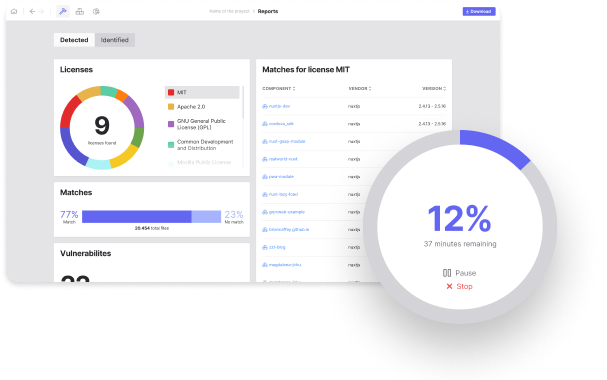

# [SCANOSS AUDIT WORKBENCH](https://scanoss.com/product)

<div>


[](https://api.reuse.software/info/github.com/scanoss/audit-workbench)


</div>

The SCANOSS Audit Workbench is a graphical user interface to scan and audit source code using SCANOSS API.

Auditing your source code for license compliance has never been easier. Simply scan your source code directory to find and identify open source components. Generate your SPDX-Lite software bill of materials (SBOM) with the press of a button.

<div align="center">
  
</div>

## Prerequisites

- Node.js v14+
- NPM (Node Packages Manager)

We strongly recommend handling your node versions using [nvm](https://github.com/nvm-sh/nvm)

## Install

```bash
npm install
```

### Troubleshooting

SCANOSS Audit Workbench uses [node-gyp](https://www.npmjs.com/package/node-gyp) to compile SQLite3 native module.
This module uses "node-pre-gyp" to download the prebuilt binary for your platform instead you need build from source.
In case it does not exist for your platform, node-gyp going to build it.

Depending on your operating system, you will need prepare the correct environment to run node-gyp: See [https://github.com/nodejs/node-gyp#installation](https://github.com/nodejs/node-gyp#installation)

## Starting Development

Start the app in the `dev` environment:

```bash
npm start
```

For live reloading you can use `npm run start --watch` to run the app using [Electronmon](https://github.com/catdad/electronmon#readme). Warning: this tool has a high memory consumption.

## Packaging for Production

To package apps for the local platform:

```bash
npm run package
```

## Multi-language (i18n)

SCANOSS Audit Workbench is multi-language enabled. To contribute a new language please see our [internationalization documentation](assets/i18n/README.md).

## Proxy Configuration
SCANOSS Audit Workbench support proxy settings, you might need to specify proxy settings depending on how your network is configured

All the configurations needs to be included in the workspace config file `~/scanoss-workspace/workspaceCfg.json`

`"PROXY": "<proxy_ip_address>:<proxy_port>"`

If your network is using a proxy with SSL interception you can include your certificate in the configuration

`  "CA_CERT": "<certificate_path>"`

## Contributing

SCANOSS Audit Workbench is an open source project, and we love to receive contributions from our community. There are many ways to contribute. For more information see the [Contributing Guide](CONTRIBUTING.md) and [Code of Conduct](CODE_OF_CONDUCT.md).

## Docs

This project was made using Electron React Boilerplate

See [docs and guides here](https://electron-react-boilerplate.js.org/docs/installation)
