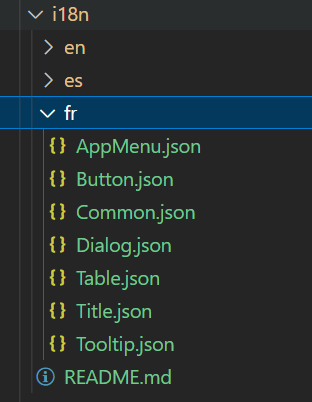

# [SCANOSS AUDIT WORKBENCH](https://scanoss.com/product) - Internacionalization (i18n)

SCANOSS Audit Workbench is multi-language enabled, which means that you can display the user interface (UI) in different languages. This is done using the internationalization-framework i18next. See [official documentation](https://www.i18next.com) for more details.

## Contributing a new lenguage

The following steps must be followed to add a new language. For example let's add a translation for the French language:

1. <b>Add new lenguage to i18n module</b>: In `src/shared/i18n/index.ts` add a new entry in `AppI18n` specifing the lenguage code in ISO 639-1 format and the original name:

```ts
  private static languages: Record<string, string> = {
    'en': 'English',
    'es': 'Español',
    'fr': 'Français', // -> the new entry!
  }
```

2. <b>Clone `assets/i18n/en` folder and rename into the new lenguage code:</b>

<div align="center">
  
</div>

3.

##
