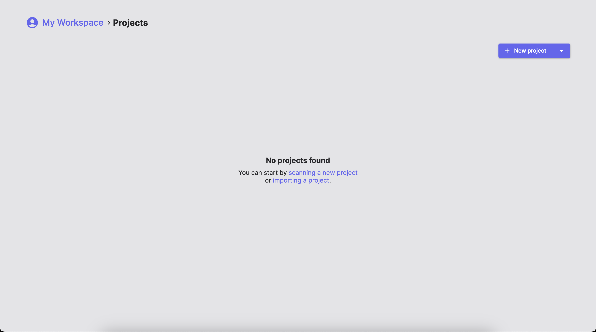
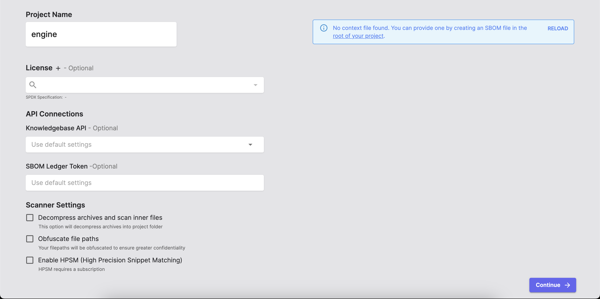
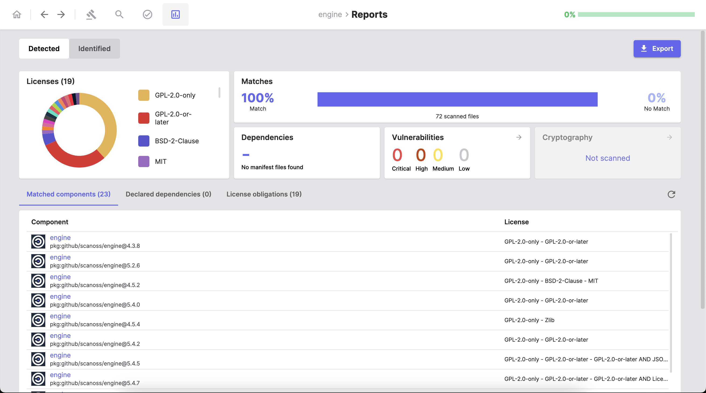
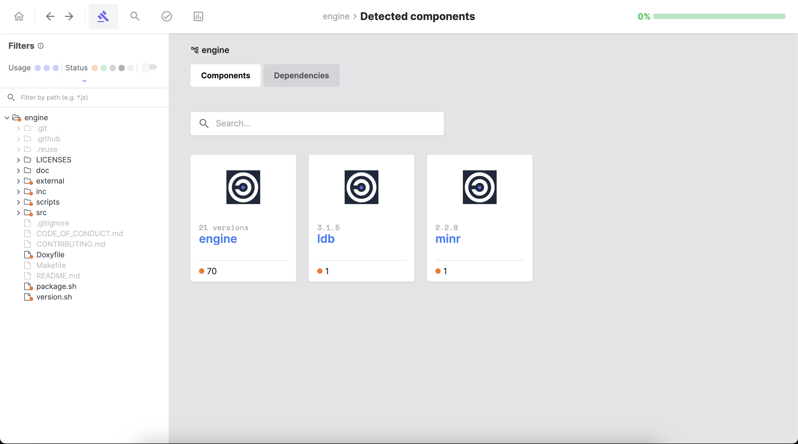
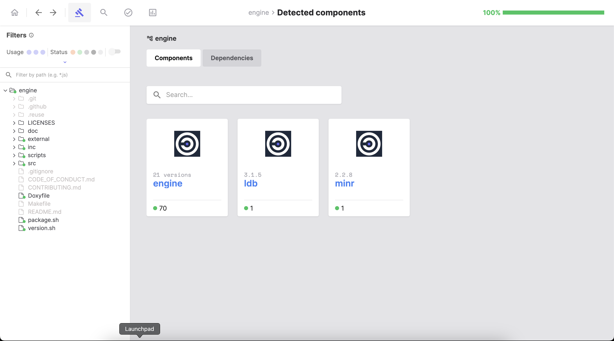
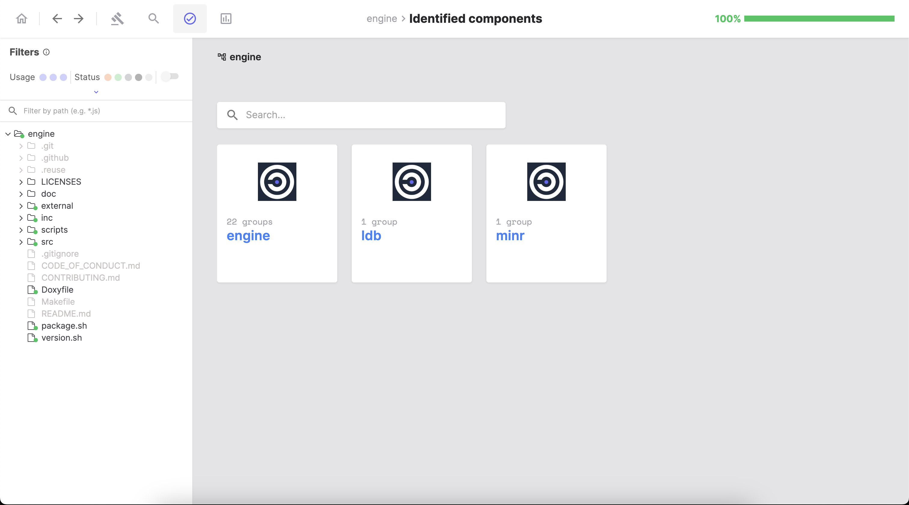
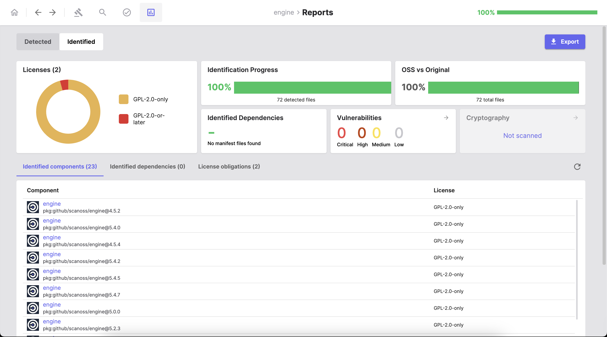
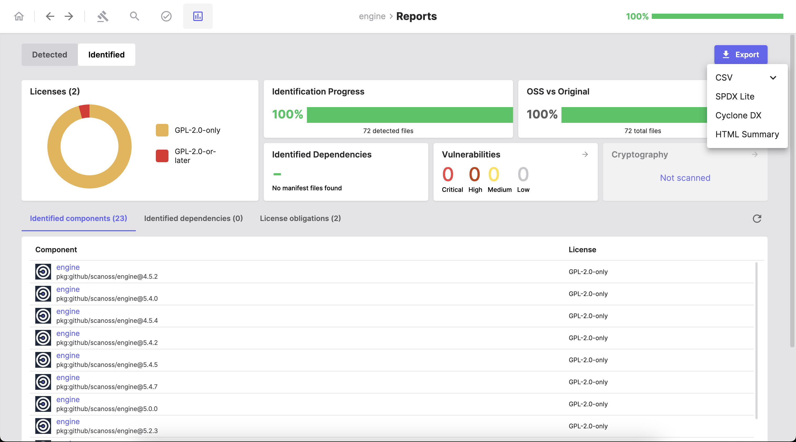

================================
Documentation for SBOM Workbench
================================

Introduction
============

The **SBOM Workbench** is a graphical user interface to scan (for example, using the free `Open Source Software Knowledge Base <https://www.softwaretransparency.org/osskb>`_) and audit source code using SCANOSS API.

Auditing your source code for license compliance has never been easier. Simply scan your source code directory to find and identify open source components. Generate your SPDX-Lite software bill of materials (SBOM) with the press of a button.

.. note::
   All of SCANOSS software is open source and free to use, explore our `GitHub Organization page <https://github.com/scanoss>`_. You can contribute to this tool, for more information check the `contribution guidelines <https://github.com/scanoss/sbom-workbench/blob/main/CONTRIBUTING.md>`_ for this project.

Features
========

* Graphical user interface to facilitate the use of the SCANOSS platform
* Scan your source code fingerprints against a knowledge base
* File, package and snippet detection
* Dependency and licenses detection
* Decoration services for cryptographic algorithm, vulnerabilities, etc
* Generate an SBOM (software bill of materials) in SPDX Lite and CycloneDX, the raw SBOM/JSON or an HTML summary 

Prerequisites
=============

* Node.js v14+
* NPM (Node Packages Manager)

We strongly recommend handling your node versions using `nvm <https://github.com/nvm-sh/nvm>`_

.. note::
   The SBOM Workbench is compatible with Windows, MacOS (ARM and x86) and Linux.

Installation and configuration
==============================

From installers
---------------

You can download the SBOM Workbench from our convenient installers, published on the `Software transparency foundation website <https://www.softwaretransparency.org/download>`_, or directly from the project's `GitHub repository <https://github.com/scanoss/sbom-workbench>`_ (from the `releases tab <https://github.com/scanoss/sbom-workbench/releases>`_).

From sources
------------

You can clone the `project's repository <https://github.com/scanoss/sbom-workbench>`_ and run ``npm install --legacy-peer-deps``.

.. note::
   Please note that you should include the ``--legacy-peer-deps`` parameter in the installation command. This is because ``@mui/styles`` is not compatible with React 18. You can find more information about this at https://mui.com/system/styles/basics/.

Configuration
-------------

SBOM Workbench support advanced settings. All the configurations needs to be included in the global config file ``~/.scanoss/sbom-workbench-settings.json``.

You can find detailed information about the different configuration options on the `README.md file <https://github.com/scanoss/sbom-workbench/blob/main/README.md>`_ on the `GitHub repository for this project <https://github.com/scanoss/sbom-workbench>`_ (under the **Workbench Configuration** section).

User interface description
==========================

Home
----
In this section, you will find your existing projects as well as the option to add a new project, or import an existing one.

You can add a new project either from the source code or the WFP fingerprint file (for example, generated with `scanoss-py <https://github.com/scanoss/scanoss.py>`_).

|

Detected components
-------------------

The SBOM Workbench offers the possibility of automatic or manual identification of components and dependencies, this section is dedicated to this feature. You will be able to check for pending files, grouped by component.

On the left tab, you can filter components by type (file, snippet, dependency) and status (pending, identified, original, no match or ignored). Also, you will have a description of the directory for this project.

|

Search keywords
---------------

This quality of life section, allows you to look for specific keywords inside your project, you can also look for keyword groups.

|

Identified components
---------------------

In this section, you will find the components identified during the first scan, and the ones you detect in the 'Detected components'.

|

Reports
-------

This is the dashboard containing details from detected and identified components. 

This tab contains the following details:

* Licenses and license obligations
* Declared and identified dependencies
* Vulnerabilities
* Match percentage (in the ``Detected`` view) 
* Identification progress and percentage of OSS vs Original code (in the ``Identified`` view)

From this tab, you will be able to export your **SBOM**.

Getting started
===============
In this section, we will go through the typical workflow from adding a project to generating your SBOM.

Add or import your project
--------------------------

In the ``Home`` tab, click the ``New project`` to add a new project from the source code itself, or click on the arrow to display te dropdown menu to add a new project from a WFP file or import an existing project (for example, from another computer) in the state it was exported.

If you choose the option to add a new project, either from sources or WFP file, you will be taken to the ``Project settings`` screen.

Here, you can customize the following things:

* Project name
* License
* API connections
* Scanner settings

.. note::
   You can provide a context file ``SBOM.json`` declaring known components to get the most accurate results.

After you add and configurate your project, the SBOM Workbench will automatically go through various stages: scanning your project, detecting licenses, analyzing for dependencies, searching for vulnerabilties, and so on.

|

First view of the Reports tab
-----------------------------
After adding and scanning your project, you will be greeted with the ``Reports`` tab. 

In this first view of the Reports tab, you will be able to visualize the information of detected components, licenses, dependencies and vulnerabiltiies from the previously mentioned stages.

|

Identify components for your project
------------------------------------
For this task, we will go to the ``Detected components`` tab.

In this tab you have the option to automatically identify the detected components/dependencies or do it by hand: selecting the name, version, license, URL (optional), PURL, usage (file, snippet or prerequisite) for this component.

.. tip::
   To display all available actions, right-click the desired file/folder. You can also restore the original state of the file/folder, in case you need to correct the identification.

.. note::
   Remember, you can also mark components as ``Original``, there is no option to ignore components because that isn't compatible with the concept of an SBOM.

|

Review the identified components
--------------------------------
After finishing the identification process, you can review it in the ``Identified components`` tab.

|

Generate a report
-----------------
Finally, we will go to the ``Identified`` view of the ``Reports`` tab to perform a final review of the project (you can also compare this view to the ``Detected`` view of this tab) and click on the ``Export`` button to select the format of your SBOM.

.. note::
   Remember the SBOM Workbench supports the following formats: CSV, SPDX Lite, CycloneDX or an HTML summary.

After clicking on the preferred format and defining the export path, the SBOM will be downloaded to the specified path.

License
=======
The Scanoss Open Source SBOM Workbench is released under the GPL-2.0-only license.

.. toctree::
   :maxdepth: 2
   :hidden:
   :caption: Links

   SCANOSS Website <https://www.scanoss.com/>
   GitHub <https://github.com/scanoss>
   Software transparency foundation <https://www.softwaretransparency.org/>

